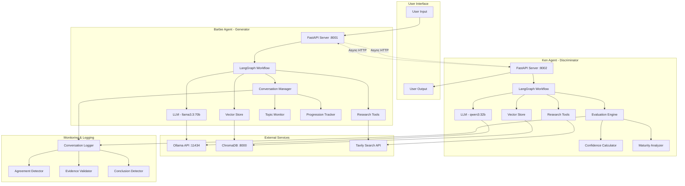
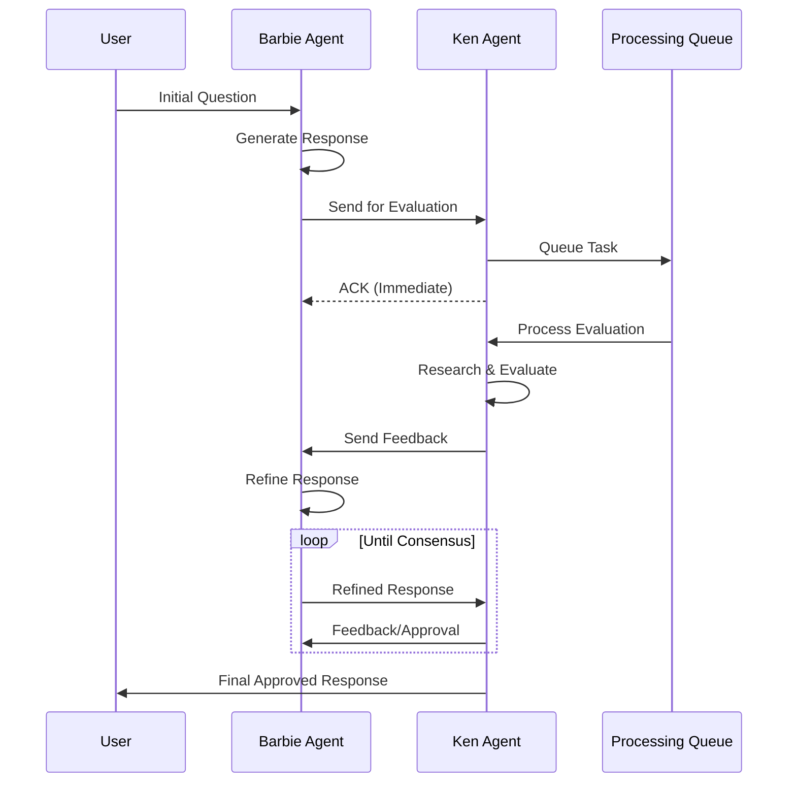
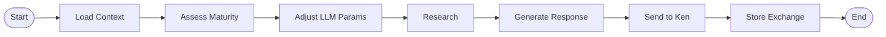
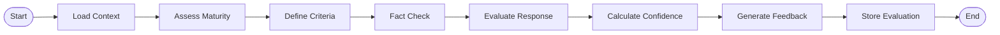
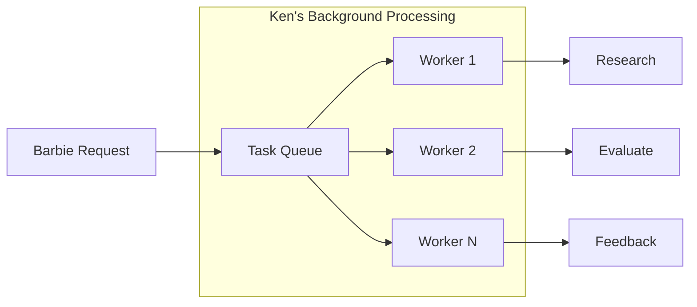
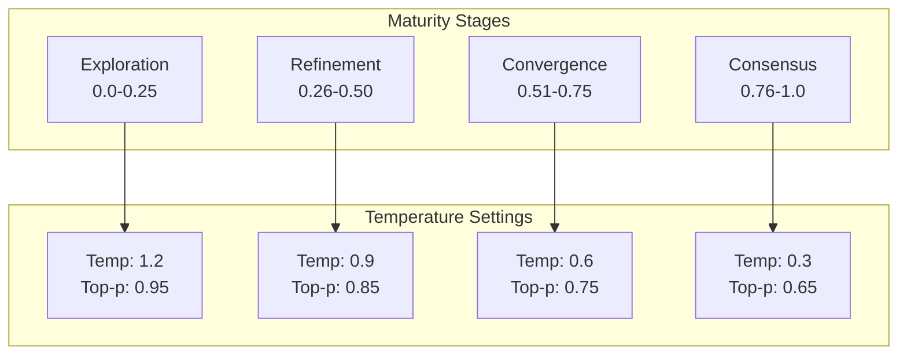
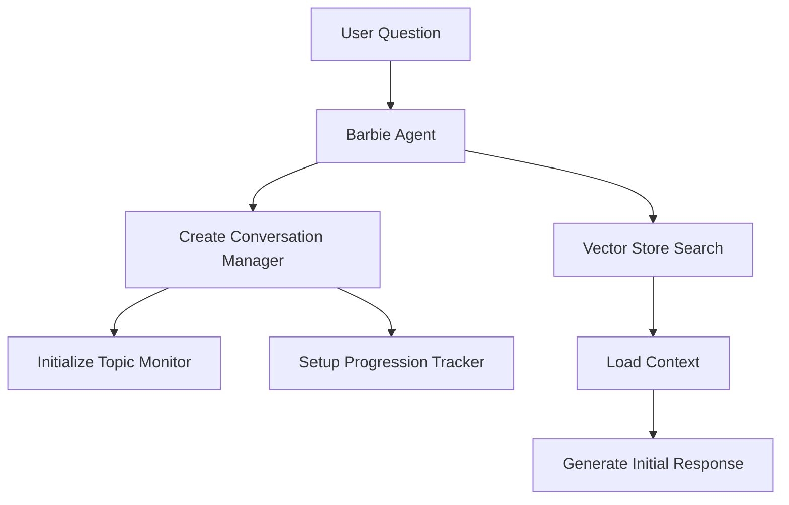
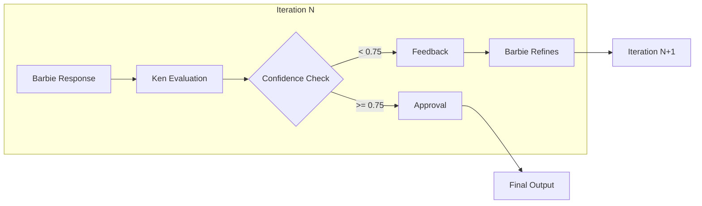

# Skynet Distributed GAN Architecture

## Table of Contents
1. [System Overview](#system-overview)
2. [Architecture Diagram](#architecture-diagram)
3. [Core Components](#core-components)
4. [Agent Details](#agent-details)
5. [Communication Protocol](#communication-protocol)
6. [Fine-Tuning System](#fine-tuning-system)
7. [Quality Control Mechanisms](#quality-control-mechanisms)
8. [Data Flow](#data-flow)
9. [Technology Stack](#technology-stack)

## System Overview

Skynet implements a distributed Generative Adversarial Network (GAN) architecture using two autonomous AI agents:
- **Barbie (Generator)**: Creates responses, generates ideas, and proposes solutions
- **Ken (Discriminator)**: Evaluates, critiques, and provides feedback on Barbie's outputs

The system achieves high-quality outputs through iterative refinement, dynamic parameter adjustment, and sophisticated conversation management.

## Architecture Diagram



## Core Components

### 1. Agent Communication Layer



### 2. LangGraph Workflows

#### Barbie's Workflow


#### Ken's Workflow


## Agent Details

### Barbie Agent (Generator)

**Purpose**: Creative content generation and solution proposals

**Key Components**:
- **Conversation Manager**: Tracks conversation state and history
- **Topic Coherence Monitor**: Ensures responses stay on topic
- **Debate Progression Tracker**: Monitors debate stages and adjusts strategy
- **Research Integration**: Uses Tavily API for web search
- **Vector Store**: ChromaDB for context retrieval

**Configuration**:
```python
{
    "model": "llama3.3:70b",
    "base_temperature": 1.2,
    "base_top_p": 0.95,
    "context_window": 4000,
    "max_rounds": 50
}
```

### Ken Agent (Discriminator)

**Purpose**: Critical evaluation and quality assurance

**Key Components**:
- **Evaluation Engine**: Multi-criteria assessment system
- **Counter-Research System**: Finds contradicting evidence
- **Confidence Calculator**: Determines approval threshold
- **Maturity Analyzer**: Tracks conversation progression
- **Error Content Filter**: Prevents technical errors from contaminating context

**Configuration**:
```python
{
    "model": "qwen3:32b",
    "base_temperature": 1.2,
    "base_top_p": 0.95,
    "approval_threshold": 0.75,
    "context_window": 4000
}
```

## Communication Protocol

### Message Format

```python
class ChatRequest:
    message: str
    conversation_id: str
    round_number: int

class ChatResponse:
    response: str
    conversation_id: str
    agent: str
    timestamp: str
    approved: bool (Ken only)
    confidence: float (Ken only)
```

### Async Processing



## Fine-Tuning System

### Dynamic Temperature Adjustment

The system adjusts LLM parameters based on conversation maturity:



### Maturity Assessment Factors

**Barbie's Maturity Calculation**:
- Conversation length (25%)
- Argument specificity (25%)
- Evidence density (25%)
- Agreement indicators (25%)

**Ken's Maturity Calculation**:
- Conversation length (25%)
- Confidence score trend (30%)
- Evaluation depth (25%)
- Critical analysis quality (20%)

## Quality Control Mechanisms

### 1. Topic Focus System

```python
# Original Question Tracking
- Stored in conversation state
- Displayed in every prompt
- Used for redirection when drift detected

# Drift Detection Patterns
- Error content filtering
- Technical discussion blocking
- Original topic reinforcement
```

### 2. Evidence Validation

```mermaid
graph LR
    BR[Barbie's Research] --> EV{Evidence Validator}
    KR[Ken's Counter-Research] --> EV
    EV --> Valid[Accept]
    EV --> Invalid[Filter Out]
    
    subgraph "Validation Criteria"
        C1[Source Credibility]
        C2[Relevance to Topic]
        C3[Not Error Content]
        C4[Recent (2023-2024)]
    end
```

### 3. Agreement Detection

```python
class AgreementDetector:
    - Analyzes semantic similarity
    - Tracks convergence patterns
    - Identifies consensus points
    - Triggers conclusion when threshold met
```

### 4. Response Filtering

**Thinking Mode Prevention**:
- Strips `<think>` tags before processing
- Filters meta-commentary patterns
- Enforces direct dialogue mode

**Error Content Blocking**:
```python
error_indicators = [
    "Error generating", "TypeError", "ValueError",
    "sequence item", "expected string but list",
    "Root Cause Analysis", "Data Validation"
]
```

## Data Flow

### 1. Conversation Initialization



### 2. Iterative Refinement



### 3. Memory and Context Management

```python
# Conversation History Structure
conversation_history = [
    "Barbie: [response_1]",
    "Ken: [feedback_1]",
    "Barbie: [response_2]",
    "Ken: [feedback_2]",
    ...
]

# Vector Store Documents
{
    "page_content": "conversation_segment",
    "metadata": {
        "timestamp": "ISO-8601",
        "agent": "barbie/ken",
        "conversation_id": "uuid",
        "round": int,
        "confidence": float
    }
}
```

## Technology Stack

### Core Technologies

| Component | Technology | Version/Model | Purpose |
|-----------|------------|---------------|---------|
| **Language Models** | Ollama | - | LLM hosting |
| Barbie LLM | Llama 3.3 | 70b | Generation |
| Ken LLM | Qwen 3 | 32b | Evaluation |
| Analyzer LLM | Qwen 2.5 | 3b | Maturity analysis |
| **Frameworks** | | | |
| Web Framework | FastAPI | Latest | REST API |
| Workflow Engine | LangGraph | Latest | State management |
| LLM Integration | LangChain | Latest | LLM orchestration |
| **Storage** | | | |
| Vector Database | ChromaDB | Latest | Context retrieval |
| Embeddings | Nomic | embed-text | Document embedding |
| **External APIs** | | | |
| Web Search | Tavily | - | Research capability |
| **Infrastructure** | | | |
| Container | Docker | Latest | Deployment |
| Runtime | Python | 3.11+ | Application runtime |

### Configuration Files

```yaml
# docker-compose.yml structure
services:
  chroma:
    port: 8000
  barbie:
    port: 8001
    depends_on: [chroma]
  ken:
    port: 8002
    depends_on: [chroma]
```

### Environment Variables

```bash
# LLM Configuration
OLLAMA_BASE_URL=http://localhost:11434
BARBIE_MODEL=llama3.3:70b
KEN_MODEL=qwen3:32b
ANALYZER_MODEL=qwen2.5:3b

# Service Configuration
CHROMA_URL=http://localhost:8000
TAVILY_API_KEY=<api_key>

# Tuning Parameters
KEN_APPROVAL_THRESHOLD=0.75
MAX_CONVERSATION_ROUNDS=50
CONTEXT_WINDOW_SIZE=4000

# Feature Flags
LOG_REFERENCES=false
STRIP_THINKING_TAGS=true
```

## Performance Optimizations

### 1. Async Processing
- Non-blocking HTTP requests between agents
- Background task queues for evaluation
- Concurrent research queries

### 2. Context Management
- Limited context window (4000 chars)
- Similarity-based retrieval (top-5 documents)
- Error content filtering

### 3. Response Quality
- Multi-stage evaluation criteria
- Counter-evidence research
- Progressive temperature adjustment
- Topic coherence monitoring

## Monitoring and Observability

### Conversation Logging

```python
# Timestamped markdown logs
data/conversation/conversation_YYYYMMDD_HHMMSS.md

# Log structure
- Original question
- Timestamped exchanges
- No error content
- No thinking tags
```

### Quality Metrics

- **Consensus Rate**: Percentage of debates reaching agreement
- **Average Rounds**: Mean iterations before consensus
- **Topic Drift Rate**: Frequency of off-topic diversions
- **Research Utilization**: Evidence citations per response

## Future Enhancements

1. **Multi-Agent Scaling**: Add specialized agents for different domains
2. **Reinforcement Learning**: Learn from successful debate patterns
3. **Custom Evaluation Models**: Train discriminator on domain-specific criteria
4. **Real-time Collaboration**: Support multiple users in debates
5. **Knowledge Graph Integration**: Build persistent knowledge representation

---

*Last Updated: 2025-09-14*
*Version: 1.0.0*