# Future Multi-Agent Collaborative System Architecture

## Executive Summary

A distributed AI system where specialized agents collaborate to solve complex problems by assuming dynamic roles, processing user-provided documents, and working together to produce comprehensive solutions through structured dialogue and consensus mechanisms.

## Table of Contents

1. [System Vision](#system-vision)
2. [Agent Roles and Responsibilities](#agent-roles-and-responsibilities)
3. [System Architecture](#system-architecture)
4. [Document Processing Pipeline](#document-processing-pipeline)
5. [Orchestration Layer](#orchestration-layer)
6. [Communication Protocol](#communication-protocol)
7. [Consensus Mechanisms](#consensus-mechanisms)
8. [Knowledge Management](#knowledge-management)
9. [Quality Assurance](#quality-assurance)
10. [Scalability Considerations](#scalability-considerations)

## System Vision

### Core Principles

1. **Dynamic Role Assignment**: Agents can switch roles based on task requirements
2. **Document-Driven Context**: All agents have access to parsed user documents
3. **Collaborative Problem Solving**: Multiple perspectives lead to better solutions
4. **Iterative Refinement**: Solutions improve through structured critique and revision
5. **Transparent Reasoning**: All agent decisions are explainable and traceable

### Key Capabilities

- Process multiple document formats (.txt, .md, .pdf)
- Maintain conversation context across multiple questions
- Dynamically assign optimal agents for specific tasks
- Synthesize diverse perspectives into coherent solutions
- Learn from successful collaboration patterns

## Agent Roles and Responsibilities

### 1. Narrator Agent
**Purpose**: Contextualizes problems and maintains narrative coherence

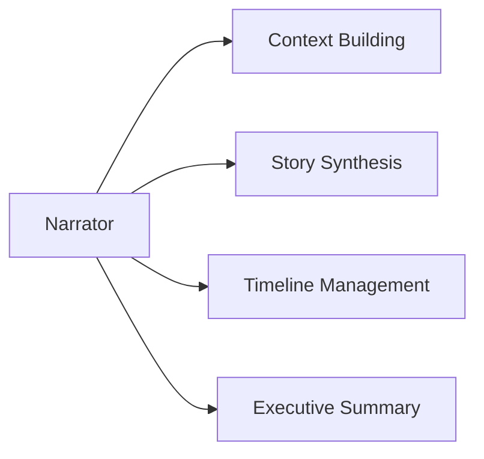

**Responsibilities**:
- Frames the problem in broader context
- Maintains narrative thread across discussions
- Summarizes progress for human understanding
- Bridges between technical and accessible language

**Triggers**:
- Complex multi-part problems
- Need for contextualization
- Summary requests
- Explanation of technical concepts

### 2. Generator Agent
**Purpose**: Creates novel solutions and ideas

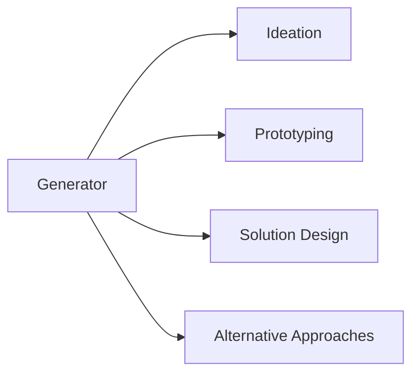

**Responsibilities**:
- Produces creative solutions
- Generates multiple alternatives
- Combines concepts from documents
- Proposes implementation strategies

**Triggers**:
- Open-ended questions
- Request for solutions
- Brainstorming needs
- Innovation requirements

### 3. Collaborator Agent
**Purpose**: Builds on and refines ideas from other agents

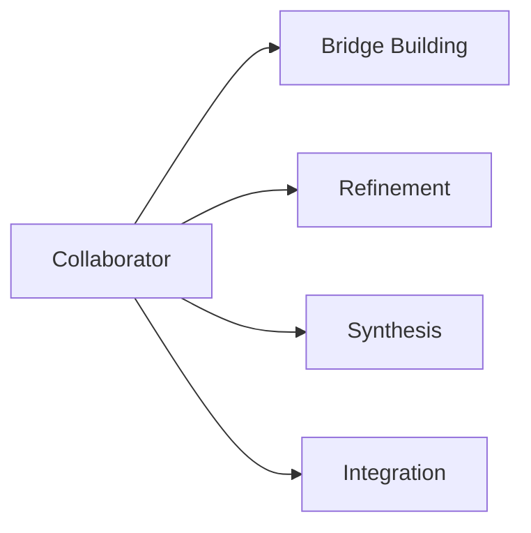

**Responsibilities**:
- Enhances proposals from other agents
- Finds synergies between different solutions
- Mediates between conflicting approaches
- Facilitates consensus building

**Triggers**:
- Multiple competing solutions
- Need for compromise
- Integration requirements
- Team coordination

### 4. Critic Agent
**Purpose**: Identifies weaknesses and improvement areas

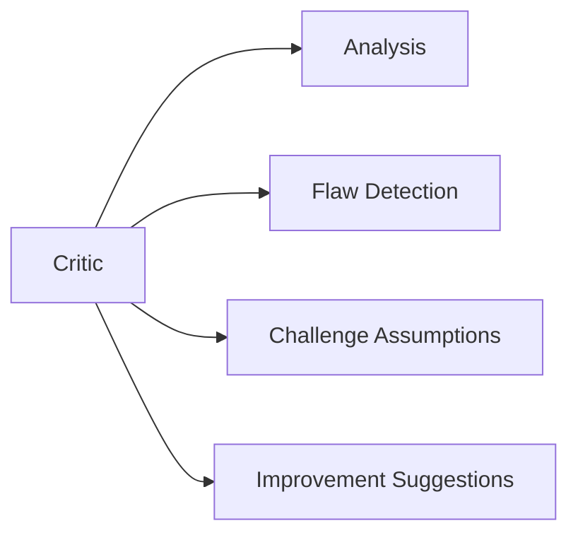

**Responsibilities**:
- Rigorous evaluation of proposals
- Identifies logical flaws
- Questions assumptions
- Suggests specific improvements

**Triggers**:
- Solution evaluation needed
- Quality assurance phase
- Risk assessment
- Validation requirements

### 5. Judge Agent
**Purpose**: Makes decisions and resolves conflicts

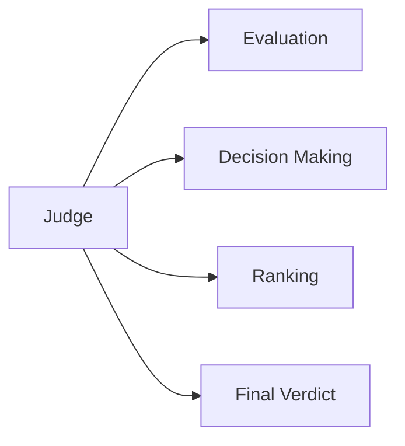

**Responsibilities**:
- Evaluates competing solutions
- Makes final decisions
- Resolves agent disagreements
- Prioritizes approaches

**Triggers**:
- Deadlock situations
- Multiple valid solutions
- Resource allocation decisions
- Final approval needed

### 6. Researcher Agent
**Purpose**: Gathers and validates information

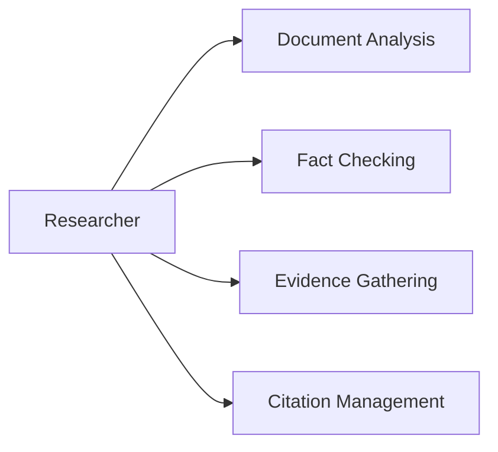

**Responsibilities**:
- Deep analysis of provided documents
- External information gathering
- Fact verification
- Evidence-based support

**Triggers**:
- Information gaps
- Verification needs
- Document analysis
- Evidence requests

## System Architecture

### High-Level Architecture

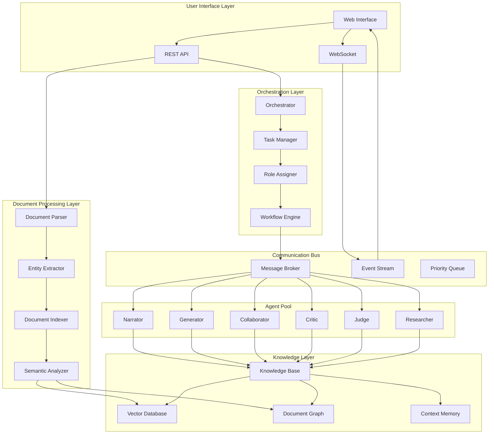

### Component Interactions

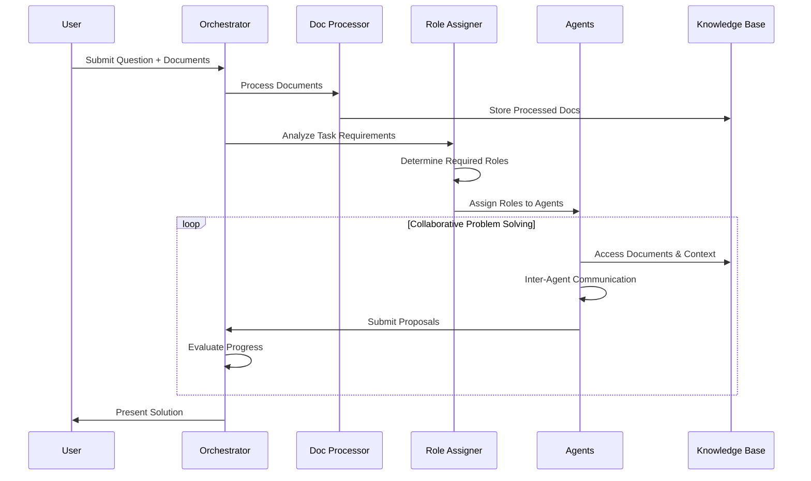

## Document Processing Pipeline

### Processing Stages

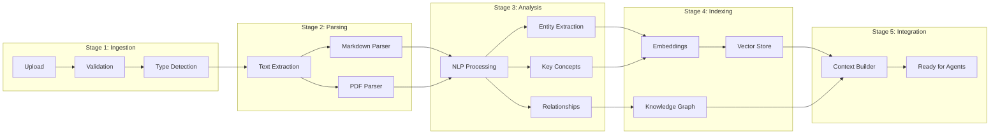

### Document Understanding Features

1. **Multi-Format Support**
   - Plain text (.txt)
   - Markdown (.md) with structure preservation
   - PDF with layout understanding
   - Future: Images, tables, code blocks

2. **Semantic Analysis**
   - Key concept extraction
   - Entity recognition
   - Relationship mapping
   - Sentiment analysis
   - Topic modeling

3. **Contextual Linking**
   - Cross-document references
   - Concept clustering
   - Temporal relationships
   - Dependency graphs

## Orchestration Layer

### Task Decomposition

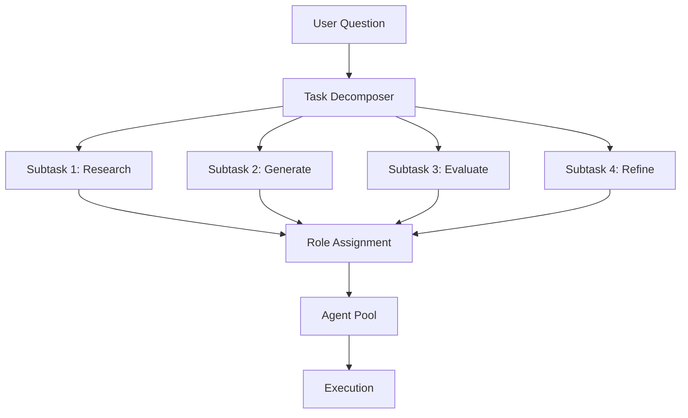

### Role Assignment Algorithm

```python
# Pseudocode for dynamic role assignment
def assign_roles(task, available_agents, context):
    required_capabilities = analyze_task_requirements(task)
    document_complexity = assess_document_complexity(context.documents)
    
    role_assignments = {}
    
    # Primary role assignment based on task type
    if task.type == "creative_solution":
        role_assignments["primary"] = "Generator"
        role_assignments["support"] = ["Researcher", "Critic"]
    elif task.type == "evaluation":
        role_assignments["primary"] = "Judge"
        role_assignments["support"] = ["Critic", "Researcher"]
    elif task.type == "synthesis":
        role_assignments["primary"] = "Collaborator"
        role_assignments["support"] = ["Narrator", "Generator"]
    
    # Adjust based on document complexity
    if document_complexity > THRESHOLD:
        role_assignments["support"].append("Researcher")
    
    # Ensure critical analysis for high-stakes problems
    if task.importance == "high":
        role_assignments["support"].append("Critic")
        role_assignments["validator"] = "Judge"
    
    return role_assignments
```

### Workflow Patterns

1. **Sequential Pattern**: Research → Generate → Critique → Judge
2. **Parallel Pattern**: Multiple Generators → Collaborator synthesis
3. **Iterative Pattern**: Generate → Critique → Refine (loop)
4. **Hierarchical Pattern**: Judge oversees multiple working groups
5. **Adaptive Pattern**: Dynamic role switching based on progress

## Communication Protocol

### Message Structure

```json
{
  "message_id": "uuid",
  "timestamp": "ISO-8601",
  "sender": {
    "agent_id": "agent_uuid",
    "role": "Generator",
    "capability_profile": {}
  },
  "recipient": {
    "agent_id": "agent_uuid | broadcast",
    "role": "Critic | all"
  },
  "message_type": "proposal | critique | question | answer | vote",
  "content": {
    "text": "message content",
    "references": ["doc_id:page:paragraph"],
    "confidence": 0.85,
    "supporting_evidence": [],
    "dependencies": ["message_id"]
  },
  "context": {
    "task_id": "task_uuid",
    "conversation_id": "conv_uuid",
    "thread_id": "thread_uuid"
  },
  "metadata": {
    "priority": "high | medium | low",
    "requires_response": true,
    "deadline": "ISO-8601"
  }
}
```

### Communication Patterns

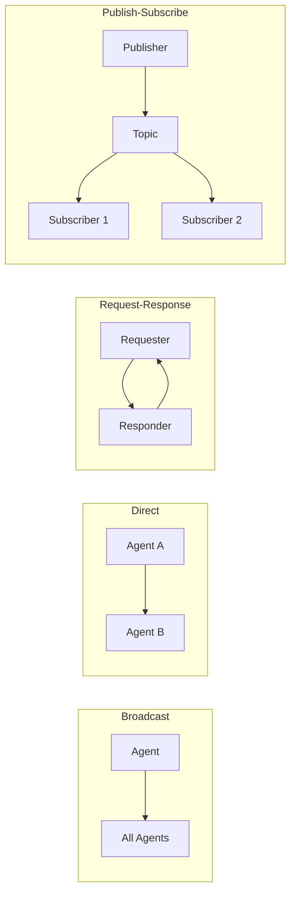

## Consensus Mechanisms

### Voting Systems

1. **Simple Majority**: For routine decisions
2. **Weighted Voting**: Based on agent expertise
3. **Unanimous Consent**: For critical decisions
4. **Qualified Majority**: Requires specific roles to agree

### Consensus Building Process

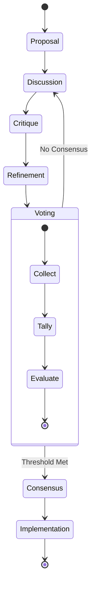

### Conflict Resolution

```python
# Pseudocode for conflict resolution
class ConflictResolver:
    def resolve(self, proposals, agents):
        # Try collaborative resolution first
        if self.can_merge(proposals):
            return self.merge_proposals(proposals)
        
        # Escalate to specialized agents
        critic_evaluation = self.critic_agent.evaluate_all(proposals)
        
        # Judge makes final decision if needed
        if not critic_evaluation.clear_winner:
            return self.judge_agent.decide(
                proposals, 
                critic_evaluation,
                context=self.document_context
            )
        
        return critic_evaluation.best_proposal
```

## Knowledge Management

### Knowledge Base Structure

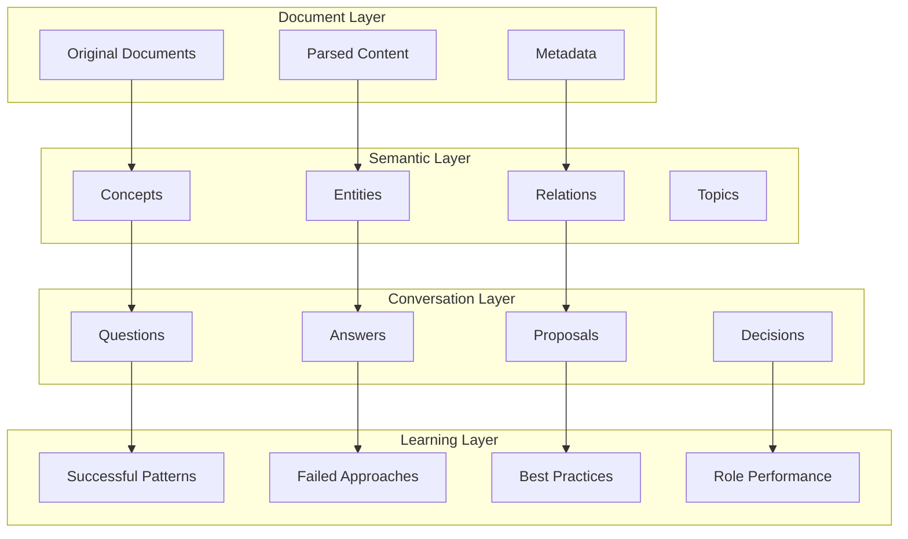

### Context Management

1. **Working Memory**: Current task context
2. **Short-term Memory**: Recent conversation history
3. **Long-term Memory**: Persistent knowledge base
4. **Episodic Memory**: Specific problem-solving sessions
5. **Semantic Memory**: General knowledge and patterns

## Quality Assurance

### Multi-Level Validation

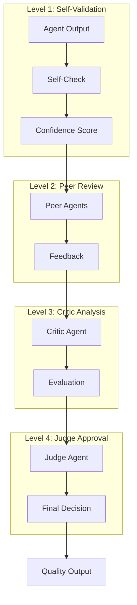

### Quality Metrics

1. **Accuracy**: Factual correctness vs. documents
2. **Completeness**: Coverage of all aspects
3. **Coherence**: Logical consistency
4. **Relevance**: Alignment with user question
5. **Creativity**: Novel insights (for Generator)
6. **Rigor**: Thoroughness of analysis (for Critic)

### Error Handling

```python
# Error handling strategy
class ErrorHandler:
    def handle_agent_failure(self, agent, error):
        # Log the error
        self.log_error(agent, error)
        
        # Attempt recovery
        if self.can_retry(error):
            return self.retry_with_backoff(agent)
        
        # Reassign to backup agent
        if self.has_backup(agent.role):
            return self.reassign_task(agent.task, self.get_backup(agent.role))
        
        # Graceful degradation
        return self.degrade_gracefully(agent.task)
```

## Scalability Considerations

### Horizontal Scaling

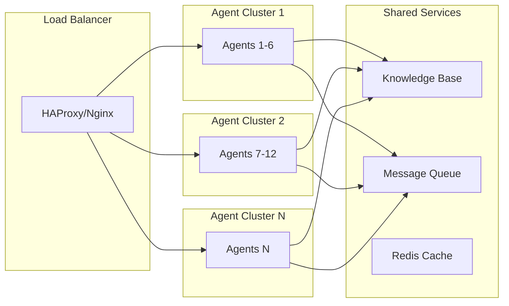

### Performance Optimization

1. **Agent Pooling**: Pre-warmed agents ready for assignment
2. **Caching**: Document embeddings and frequent queries
3. **Batch Processing**: Group similar tasks
4. **Async Operations**: Non-blocking agent communication
5. **Resource Quotas**: Prevent single task monopolization

### Deployment Architecture

```yaml
# Kubernetes deployment structure
services:
  orchestrator:
    replicas: 3
    resources:
      cpu: 2
      memory: 4Gi
  
  agent-pool:
    replicas: 12  # 2 instances per role
    resources:
      cpu: 4
      memory: 8Gi
    autoscaling:
      min: 6
      max: 24
      target_cpu: 70%
  
  document-processor:
    replicas: 2
    resources:
      cpu: 2
      memory: 4Gi
  
  knowledge-base:
    type: StatefulSet
    replicas: 3
    storage: 100Gi
  
  message-broker:
    type: RabbitMQ
    replicas: 3
    
  vector-database:
    type: Qdrant/Weaviate
    replicas: 3
    storage: 50Gi
```

## Implementation Roadmap

### Phase 1: Foundation (Months 1-3)
- Core agent framework
- Basic role implementation
- Document parsing (.txt, .md)
- Simple orchestration

### Phase 2: Intelligence (Months 4-6)
- Advanced document processing (PDF)
- Knowledge graph integration
- Sophisticated role behaviors
- Inter-agent communication

### Phase 3: Optimization (Months 7-9)
- Consensus mechanisms
- Quality assurance framework
- Performance optimization
- Scalability improvements

### Phase 4: Advanced Features (Months 10-12)
- Machine learning integration
- Pattern recognition
- Adaptive role assignment
- Self-improvement capabilities

## Success Metrics

1. **Solution Quality**: Accuracy, completeness, creativity
2. **Processing Speed**: Time to solution
3. **Resource Efficiency**: Compute utilization
4. **User Satisfaction**: Feedback scores
5. **System Reliability**: Uptime, error rates
6. **Scalability**: Concurrent users supported
7. **Learning Rate**: Improvement over time

## Risk Mitigation

### Technical Risks
- **Agent Deadlock**: Timeout mechanisms, deadlock detection
- **Knowledge Drift**: Regular validation against source documents
- **Scaling Bottlenecks**: Distributed architecture, caching
- **Data Loss**: Redundant storage, regular backups

### Operational Risks
- **Cost Management**: Resource quotas, cost monitoring
- **Security**: Role-based access, encryption, audit logs
- **Compliance**: Data retention policies, privacy controls

## Conclusion

This architecture provides a robust foundation for a multi-agent collaborative system that can:
1. Process and understand complex documents
2. Dynamically assign specialized roles
3. Collaborate effectively to solve problems
4. Learn and improve over time
5. Scale to handle multiple users and complex tasks

The modular design allows for incremental development and easy extension with new agent roles or capabilities as requirements evolve.

---

*Version: 1.0.0*  
*Last Updated: 2025-09-14*  
*Status: Design Proposal*